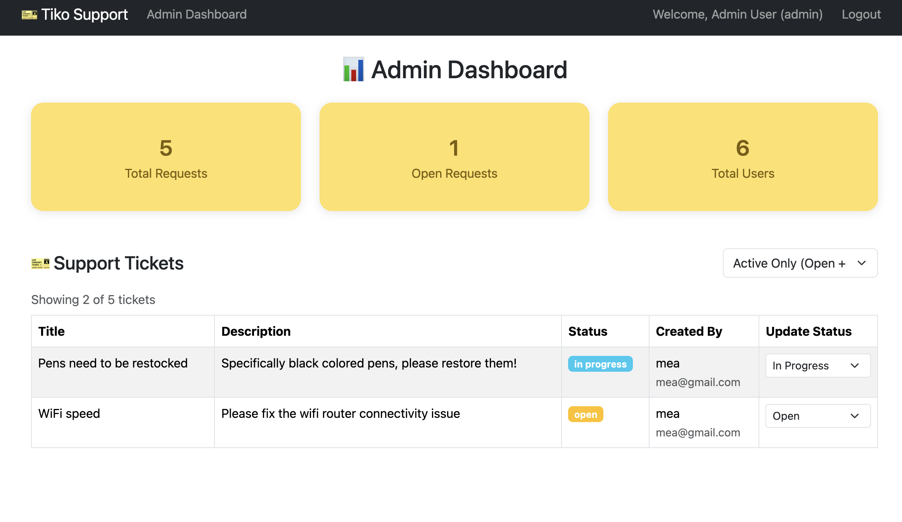
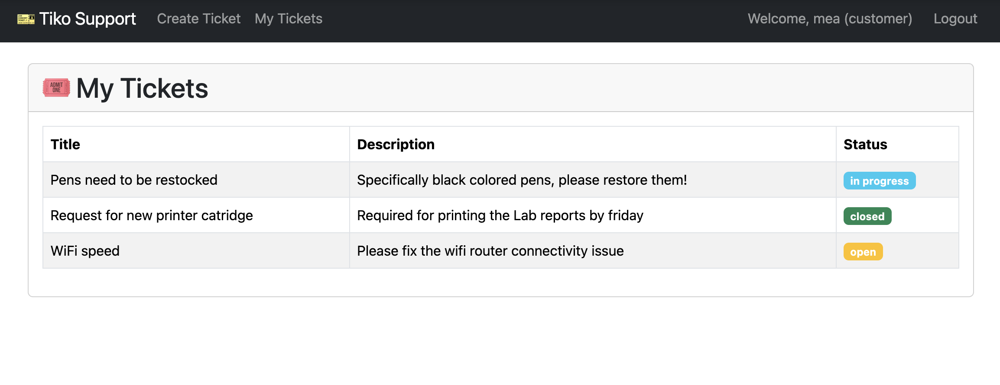

# Tiko – Customer Support Ticketing App

Tiko is a full-stack customer support ticketing system built with React, Node.js, Express, and MongoDB. It features role-based authentication, a modern admin dashboard, and a seamless ticket management experience for both admins and customers.

---

## 🚀 Product Previews

### **Admin Dashboard**


### **Customer Tickets**


---

## ✨ Features

- **Role-based Authentication:** Secure login and registration for both admins and customers.
- **Ticket Management:** Customers can create, view, and track support tickets; admins can view, filter, and update ticket statuses.
- **Modern UI:** Responsive, user-friendly interface with a bento-style admin dashboard and Bootstrap styling.

---

## 📝 How to Run Locally

### 1. **Clone the repo:**
   ```bash
   git clone https://github.com/yourusername/tiko.git
   cd tiko
   ```

### 2. **Install dependencies**

**Backend:**

```bash
cd backend
npm install
```

**Frontend:**

```bash
cd ../frontend
npm install
```

### 3. **Set up environment variables**

**Create `backend/.env`:**

```
MONGODB_URI=your_mongodb_uri
JWT_SECRET=your_jwt_secret
PORT=3001
```

**Create `frontend/.env`:**

```
REACT_APP_API_URL=http://localhost:3001
```

### 4. **Start the app**

**Backend:**

```bash
cd backend
npm start
```

**Frontend (in a new terminal):**

```bash
cd frontend
npm start
```


## 📚 Tech Stack

* **Frontend:** React, React Bootstrap
* **Backend:** Node.js, Express
* **Database:** MongoDB (with Mongoose)
* **Auth:** JWT, bcrypt
* **Other:** Axios, dotenv

```
